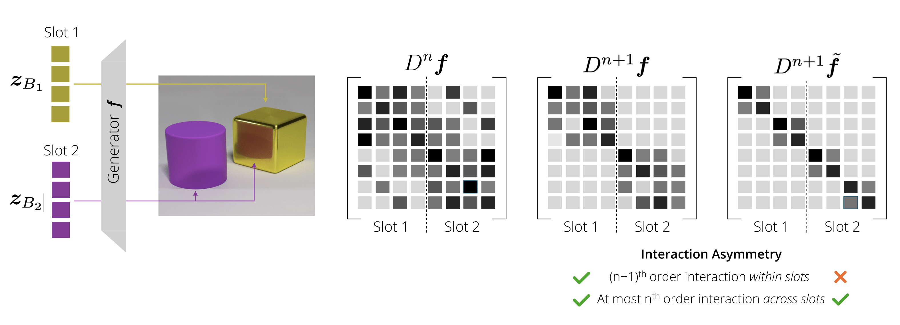

# Interaction Asymmetry: A General Principle for Learning Composable Abstractions
Official code for the paper [Interaction Asymmetry: A General Principle for Learning Composable Abstractions](https://arxiv.org/abs/2411.07784).




## Datasets
The Sprites, CLEVR6, and CLEVR-Tex datasets used in our experiments can be downloaded at the following [link](https://nc.mlcloud.uni-tuebingen.de/index.php/s/LsQ5mCgtAstMkXy).


## Experiments
The following commands can be used to run experiments using the regularized Transformer autoencoder from our paper.

**Sprites**:
```
python --data "sprites" --encoder "transformer" --decoder "transformer" --alpha 0.05 --beta 0.05
```

**CLEVR6**
```
python --data "clevr" --encoder "transformer" --decoder "transformer" --alpha 0.05 --beta 0.05
```

**CLEVRTex**
```
python --data "clevrtex" --encoder "transformer" --decoder "transformer" --alpha 0.05 --beta 0.05
```

To use the baseline models in our experiments, the inputs for the encoder/decoder and hyperparameter values should be changed accordingly.

## BibTeX

If you make use of this code in your own work, please cite our paper:
```
@article{brady2024interaction,
  title={Interaction Asymmetry: A General Principle for Learning Composable Abstractions},
  author={Brady, Jack and von K{\"u}gelgen, Julius and Lachapelle, S{\'e}bastien and Buchholz, Simon and Kipf, Thomas and Brendel, Wieland},
  journal={arXiv preprint arXiv:2411.07784},
  year={2024}
}
```