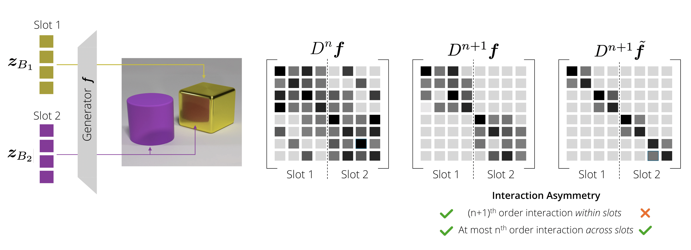

# Interaction Asymmetry: A General Principle for Learning Composable Abstractions
Official code for the paper [Interaction Asymmetry: A General Principle for Learning Composable Abstractions](https://arxiv.org/submit/5994558).

